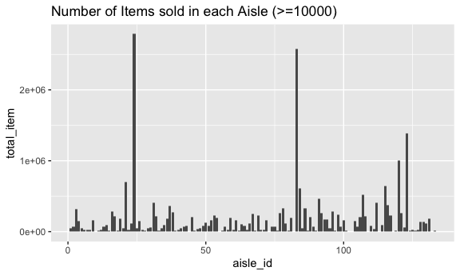
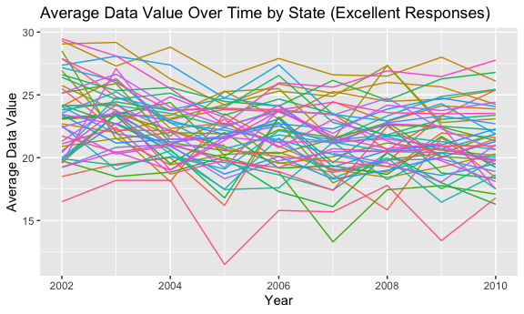
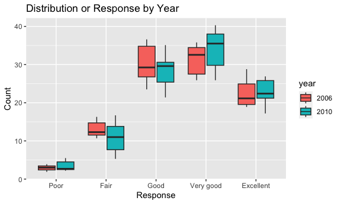
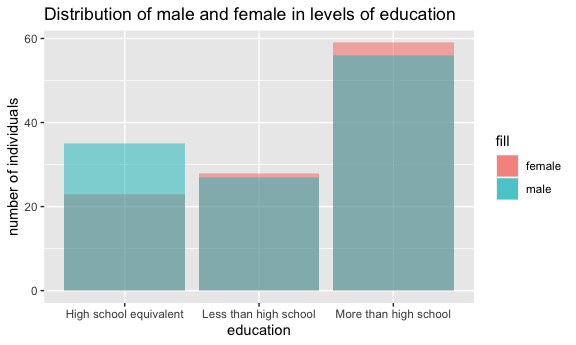
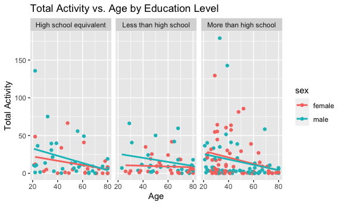
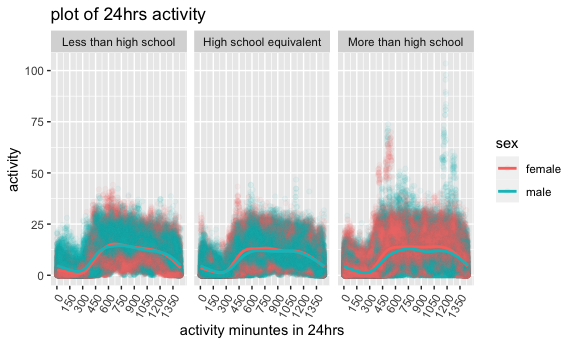

p8105_hw3_lz2949
================
Longyi Zhao
2023-10-09

``` r
library(tidyverse)
```

    ## ── Attaching core tidyverse packages ──────────────────────── tidyverse 2.0.0 ──
    ## ✔ dplyr     1.1.3     ✔ readr     2.1.4
    ## ✔ forcats   1.0.0     ✔ stringr   1.5.0
    ## ✔ ggplot2   3.4.3     ✔ tibble    3.2.1
    ## ✔ lubridate 1.9.2     ✔ tidyr     1.3.0
    ## ✔ purrr     1.0.2     
    ## ── Conflicts ────────────────────────────────────────── tidyverse_conflicts() ──
    ## ✖ dplyr::filter() masks stats::filter()
    ## ✖ dplyr::lag()    masks stats::lag()
    ## ℹ Use the conflicted package (<http://conflicted.r-lib.org/>) to force all conflicts to become errors

``` r
library(dplyr)
library(ggplot2)
library(knitr)

knitr::opts_chunk$set(
  fig.width = 6,
  fig.asp = .6,
  out.width = "90%"
)
```

## Problem 1

``` r
library(p8105.datasets)
data("instacart")
```

This dataset contains 1384617 rows and 15 columns, with each row
resprenting a single product from an instacart order. Variables include
identifiers for user, order, and product; the order in which each
product was added to the cart. There are several order-level variables,
describing the day and time of the order, and number of days since prior
order. Then there are several item-specific variables, describing the
product name (e.g. Yogurt, Avocado), department (e.g. dairy and eggs,
produce), and aisle (e.g. yogurt, fresh fruits), and whether the item
has been ordered by this user in the past. In total, there are 39123
products found in 131209 orders from 131209 distinct users.

``` r
num_aisles = unique(instacart$aisle_id) # number of distinct aisles numbers
frequent_aisles = 
  instacart %>% 
  group_by(aisle) %>%
  summarize(total_item = sum(order_number)) |>
  arrange(desc(total_item)) # most items ordered from 
```

make a plot that shows the number of items ordered in each aisle, (only
aisles ordered more than 10000 items)

``` r
instacart |>
  count(aisle) |> 
  filter(n > 10000) |> 
  mutate(aisle = fct_reorder(aisle, n)) |> 
  ggplot(aes(x = aisle, y = n)) + 
  geom_point() + 
  labs(title = "Number of items ordered in each aisle") +
  theme(axis.text.x = element_text(angle = 60, hjust = 1))
```



Make a table showing the three most popular items in “baking
ingredients”, “dog food care”, and “packaged vegetable fruits”

``` r
instacart |> 
  filter(aisle %in% c("baking ingredients", "dog food care", "packaged vegetables fruits")) |>
  group_by(aisle) |> 
  count(product_name) |> 
  mutate(rank = min_rank(desc(n))) |> 
  filter(rank < 4) |> 
  arrange(desc(n)) |>
  knitr::kable()
```

| aisle                      | product_name                                  |    n | rank |
|:---------------------------|:----------------------------------------------|-----:|-----:|
| packaged vegetables fruits | Organic Baby Spinach                          | 9784 |    1 |
| packaged vegetables fruits | Organic Raspberries                           | 5546 |    2 |
| packaged vegetables fruits | Organic Blueberries                           | 4966 |    3 |
| baking ingredients         | Light Brown Sugar                             |  499 |    1 |
| baking ingredients         | Pure Baking Soda                              |  387 |    2 |
| baking ingredients         | Cane Sugar                                    |  336 |    3 |
| dog food care              | Snack Sticks Chicken & Rice Recipe Dog Treats |   30 |    1 |
| dog food care              | Organix Chicken & Brown Rice Recipe           |   28 |    2 |
| dog food care              | Small Dog Biscuits                            |   26 |    3 |

Make a table showing the mean hour of the day at which Pink lady apples
and coffee ice cream are orderd on each day of the week.

``` r
app_cream = 
  instacart |>
  filter(product_name == "Pink Lady Apples" | product_name == "Coffee Ice Cream") |>
  group_by(product_name, order_dow) |>
  summarize(mean_time = mean(order_hour_of_day)) |>
  pivot_wider(names_from = product_name,
              values_from = mean_time) 
```

    ## `summarise()` has grouped output by 'product_name'. You can override using the
    ## `.groups` argument.

``` r
# app_cream = app_cream[, -1]
kable(app_cream, 
      caption = "Mean hour of the day ordered for Pink Lady Apples and Coffee Ice Cream")
```

| order_dow | Coffee Ice Cream | Pink Lady Apples |
|----------:|-----------------:|-----------------:|
|         0 |         13.77419 |         13.44118 |
|         1 |         14.31579 |         11.36000 |
|         2 |         15.38095 |         11.70213 |
|         3 |         15.31818 |         14.25000 |
|         4 |         15.21739 |         11.55172 |
|         5 |         12.26316 |         12.78431 |
|         6 |         13.83333 |         11.93750 |

Mean hour of the day ordered for Pink Lady Apples and Coffee Ice Cream

## Problem 2

``` r
library(p8105.datasets)
data("brfss_smart2010")
```

Data cleaning

``` r
brfss_df = 
  brfss_smart2010 |>
  janitor::clean_names() |>
  filter(topic == "Overall Health") |>
  filter(response == "Excellent" | response =="Very good" |response =="Good" |response =="Fair" |response =="Poor") 

order_c = c("Poor", "Fair", "Good", "Very good", "Excellent")
ordered_brfss = brfss_df[order(factor(brfss_df$response, levels = order_c)),]
```

In 2002/2010, which states were observed at 7 or more locations?

``` r
# year 2002
states_two = ordered_brfss |>
  filter(year == "2002") |>
  group_by(locationabbr) |>
  summarize(unique_locations = n_distinct(locationdesc)) 
states_two = states_two |>
  filter(unique_locations >= 7)

# year 2010
states_ten = ordered_brfss |>
  filter(year == "2010") |>
  group_by(locationabbr) |>
  summarize(unique_locations = n_distinct(locationdesc)) 
states_ten = states_ten |>
  filter(unique_locations >= 7)
```

Comments: In 2002, there are 6 states observed at 7 or more locations;
in 2010, the number is 14.

Construct a dataset that is limited to Excellent responses and contains,
year, state, and a variable averages the data_value accross locations
within a state. Make a spaghetti plot.

``` r
exc_df = ordered_brfss |>
  filter(response == "Excellent") |>
  group_by(locationabbr, year) |>
  mutate(ave_data = mean(data_value)) |>
  select(year, locationabbr, ave_data) 

ggplot(exc_df, aes(x = year, 
                  y = ave_data,
                  group = locationabbr, 
                  color = locationabbr)) +
  geom_line() +
  labs(
    title = "Average Data Value Over Time by State (Excellent Responses)",
    x = "Year",
    y = "Average Data Value"
  )
```

    ## Warning: Removed 65 rows containing missing values (`geom_line()`).


Comments:

Make a two-panel plot showing, for 2006/2010, distribution of data_value
for responses (poor to excellent) among locations in NY state.

``` r
ny_df = ordered_brfss |>
  filter(locationabbr == "NY", year %in% c("2006", "2010")) 

ggplot(ny_df, aes(x = year, fill = response)) + geom_bar() +
  labs(
    title = "Distribution or Response by Year", 
    x = "Year", 
    y = "Count"
  )
```



``` r
# among locations??
```

Comments: In 2010, more responses are collected. In 2010, there are 45
responses, and in 2006, the number is 30. By looking at the plot, poor
to excellent responses are evenly distributed among all responses.

## Problem 3

Load, tidy, merge, and organize the datasets: include all originally
observed variables, exclude participants \<21, exclude missing
demographic data, encode data with reasonable variable classes.

``` r
nhanes_df = 
  read_csv("./data/nhanes_covar.csv", skip = 4) |>
  janitor::clean_names() |>
  filter(age>=21) |>
  drop_na() |>
  mutate( 
    sex = case_match(
      sex,
      1 ~ "male", 
      2 ~ "female"
    ), 
    education=case_match(education, 
                           1~ "Less than high school", 
                         2 ~ "High school equivalent", 
                         3 ~ "More than high school"))
```

    ## Rows: 250 Columns: 5
    ## ── Column specification ────────────────────────────────────────────────────────
    ## Delimiter: ","
    ## dbl (5): SEQN, sex, age, BMI, education
    ## 
    ## ℹ Use `spec()` to retrieve the full column specification for this data.
    ## ℹ Specify the column types or set `show_col_types = FALSE` to quiet this message.

``` r
# drop na??
nhanes_accel = 
  read_csv("./data/nhanes_accel.csv") |>
  janitor::clean_names()
```

    ## Rows: 250 Columns: 1441
    ## ── Column specification ────────────────────────────────────────────────────────
    ## Delimiter: ","
    ## dbl (1441): SEQN, min1, min2, min3, min4, min5, min6, min7, min8, min9, min1...
    ## 
    ## ℹ Use `spec()` to retrieve the full column specification for this data.
    ## ℹ Specify the column types or set `show_col_types = FALSE` to quiet this message.

``` r
m_nhanes = inner_join(nhanes_df, nhanes_accel, by = "seqn")
```

Create a reader-friendly table for the number of men and women in each
education category.

``` r
education_table = m_nhanes |>
  group_by(education, sex) |>
  summarize(count = n()) |>
  pivot_wider(names_from =  sex, 
              values_from = count)
```

    ## `summarise()` has grouped output by 'education'. You can override using the
    ## `.groups` argument.

``` r
kable(education_table, caption = "Sex and corresponding education level")
```

| education              | female | male |
|:-----------------------|-------:|-----:|
| High school equivalent |     23 |   35 |
| Less than high school  |     28 |   27 |
| More than high school  |     59 |   56 |

Sex and corresponding education level

Comments: At high school equivalent, number of males is larger than
female, there are

Create a visualization of the age distributions for men and women in
each education category.

``` r
ggplot(education_table, aes(x= education))+
  geom_bar(aes(y = female, fill = "female"), position = "dodge", stat = "identity", alpha =0.5 )+
  geom_bar(aes(y= male, fill = "male"), position = "dodge", stat = "identity", alpha = 0.5) +
  labs(title = "Distribution of male and female in levels of education", 
       x = "education", 
       y = "number of individuals") 
```


Comments:

Using tidies dataset, aggregate across minutes to create a total
activity variable for each participant. Plot total activities (y)
against age (x). Compare men to women and have separater panels for each
education level. Include trend line or a smooth to illustrate
differences.

``` r
sum_nhanes = m_nhanes |>
  rowwise() |>
  mutate(sum_acti = sum(c(min1:min1440))) |>
  select(-6:-1445)

ggplot(sum_nhanes, aes(x = age, y = sum_acti, color = sex)) +
  geom_point() +
  geom_smooth(method = "lm", formula = y ~ x, se = FALSE) +
  facet_wrap(~ education) +
  labs(
    title = "Total Activity vs. Age by Education Level",
    x = "Age",
    y = "Total Activity"
  ) 
```


Comments:

Make a three-panel plot that shows the 24 hour activity time courses for
each education level and use color to indicate sex.

``` r
day_activity = m_nhanes |>
  pivot_longer(cols = min1:min1440, names_to = "activity_minutes", values_to = "activity") 

day_activity$activity_minutes = gsub("min", "", day_activity$activity_minutes) # remove "min" in the xlabel

ggplot(day_activity, aes(x=activity_minutes, y = activity, color = sex))+
  geom_line() +
  facet_wrap(~education, scales = "free_y", ncol = 1) +
  labs(
    title = "plot of 24hrs activity",
    x = "activity minuntes in 24hrs",
    y = "activity"
  ) +
  scale_x_discrete(labels = function(x) ifelse(seq_along(x) %% 70 == 0, x, ""))
```



``` r
# not sure
```

Comments:
