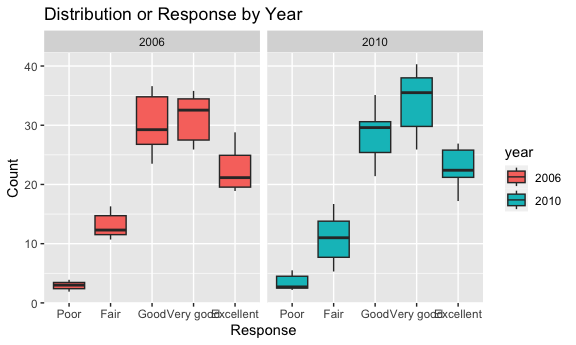
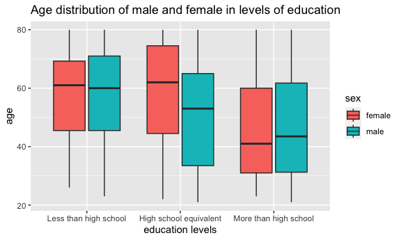
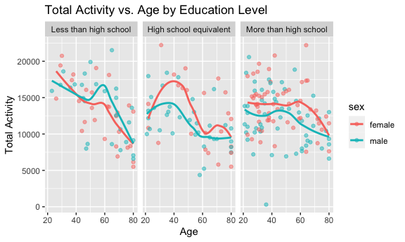

p8105_hw3_lz2949
================
Longyi Zhao
2023-10-09

``` r
library(tidyverse)
```

    ## ── Attaching core tidyverse packages ──────────────────────── tidyverse 2.0.0 ──
    ## ✔ dplyr     1.1.3     ✔ readr     2.1.4
    ## ✔ forcats   1.0.0     ✔ stringr   1.5.0
    ## ✔ ggplot2   3.4.3     ✔ tibble    3.2.1
    ## ✔ lubridate 1.9.2     ✔ tidyr     1.3.0
    ## ✔ purrr     1.0.2     
    ## ── Conflicts ────────────────────────────────────────── tidyverse_conflicts() ──
    ## ✖ dplyr::filter() masks stats::filter()
    ## ✖ dplyr::lag()    masks stats::lag()
    ## ℹ Use the conflicted package (<http://conflicted.r-lib.org/>) to force all conflicts to become errors

``` r
library(ggplot2)
library(knitr)

knitr::opts_chunk$set(
  fig.width = 6,
  fig.asp = .6,
  out.width = "90%"
)
```

## Problem 1

``` r
library(p8105.datasets)
data("instacart")
```

This dataset contains 1384617 rows and 15 columns, with each row
resprenting a single product from an instacart order. Variables include
identifiers for user, order, and product; the order in which each
product was added to the cart. There are several order-level variables,
describing the day and time of the order, and number of days since prior
order. Then there are several item-specific variables, describing the
product name (e.g. Yogurt, Avocado), department (e.g. dairy and eggs,
produce), and aisle (e.g. yogurt, fresh fruits), and whether the item
has been ordered by this user in the past. In total, there are 39123
products found in 131209 orders from 131209 distinct users.

``` r
num_aisles = unique(instacart$aisle_id) # number of distinct aisles numbers
frequent_aisles = 
  instacart |>
  group_by(aisle) |>
  summarize(total_item = sum(order_number)) |>
  arrange(desc(total_item)) # most items ordered from 
```

Comments: In this dataset, there are 134 distinct aisles. Most items are
ordered from fresh fruits, fresh vegetables, packaged vegetables fruits,
yogurt, packaged cheese.

Make a plot that shows the number of items ordered in each aisle, (only
aisles ordered more than 10000 items), aisles are ordered by ascending
number of items.

``` r
instacart |>
  count(aisle) |> 
  filter(n > 10000) |> 
  mutate(aisle = fct_reorder(aisle, n)) |> 
  ggplot(aes(x = aisle, y = n)) + 
  geom_point() + 
  labs(title = "Number of items ordered in each aisle") +
  theme(axis.text.x = element_text(angle = 60, hjust = 1))
```


Comments: From the plot, items ordered from fresh vegetable and fresh
fruit are the most; items ordered from butter and oils vinegars are the
least.

Make a table showing the three most popular items in “baking
ingredients”, “dog food care”, and “packaged vegetable fruits”

``` r
instacart |> 
  filter(aisle %in% c("baking ingredients", "dog food care", "packaged vegetables fruits")) |>
  group_by(aisle) |> 
  count(product_name) |> 
  mutate(rank = min_rank(desc(n))) |> 
  filter(rank < 4) |> 
  arrange(desc(n)) |>
  knitr::kable()
```

| aisle                      | product_name                                  |    n | rank |
|:---------------------------|:----------------------------------------------|-----:|-----:|
| packaged vegetables fruits | Organic Baby Spinach                          | 9784 |    1 |
| packaged vegetables fruits | Organic Raspberries                           | 5546 |    2 |
| packaged vegetables fruits | Organic Blueberries                           | 4966 |    3 |
| baking ingredients         | Light Brown Sugar                             |  499 |    1 |
| baking ingredients         | Pure Baking Soda                              |  387 |    2 |
| baking ingredients         | Cane Sugar                                    |  336 |    3 |
| dog food care              | Snack Sticks Chicken & Rice Recipe Dog Treats |   30 |    1 |
| dog food care              | Organix Chicken & Brown Rice Recipe           |   28 |    2 |
| dog food care              | Small Dog Biscuits                            |   26 |    3 |

Make a table showing the mean hour of the day at which Pink lady apples
and coffee ice cream are orderd on each day of the week.

``` r
app_cream = 
  instacart |>
  filter(product_name == "Pink Lady Apples" | product_name == "Coffee Ice Cream") |>
  group_by(product_name, order_dow) |>
  summarize(mean_time = mean(order_hour_of_day)) |>
  pivot_wider(names_from = product_name,
              values_from = mean_time) 
```

    ## `summarise()` has grouped output by 'product_name'. You can override using the
    ## `.groups` argument.

``` r
# app_cream = app_cream[, -1]
kable(app_cream, 
      caption = "Mean hour of the day ordered for Pink Lady Apples and Coffee Ice Cream")
```

| order_dow | Coffee Ice Cream | Pink Lady Apples |
|----------:|-----------------:|-----------------:|
|         0 |         13.77419 |         13.44118 |
|         1 |         14.31579 |         11.36000 |
|         2 |         15.38095 |         11.70213 |
|         3 |         15.31818 |         14.25000 |
|         4 |         15.21739 |         11.55172 |
|         5 |         12.26316 |         12.78431 |
|         6 |         13.83333 |         11.93750 |

Mean hour of the day ordered for Pink Lady Apples and Coffee Ice Cream

## Problem 2

``` r
library(p8105.datasets)
data("brfss_smart2010")
```

Data cleaning: I changed the Locationabbr to state_name and Locationdesc
to county_name to make these two variable names easier to understand.

``` r
brfss_df = 
  brfss_smart2010 |>
  rename("state_name" = "Locationabbr") |>
  rename("county_name" = "Locationdesc") |>
  janitor::clean_names() |>
  filter(topic == "Overall Health") |>
  filter(response == "Excellent" | response =="Very good" |response =="Good" |response =="Fair" |response =="Poor") 

# order responses from poor to excellent
order_c = c("Poor", "Fair", "Good", "Very good", "Excellent")
ordered_brfss = brfss_df[order(factor(brfss_df$response, levels = order_c)),]
```

In 2002/2010, which states were observed at 7 or more locations.

``` r
# year 2002
states_two = ordered_brfss |>
  filter(year == "2002") |>
  group_by(state_name) |>
  summarize(unique_locations = n_distinct(county_name)) 
states_two = states_two |>
  filter(unique_locations >= 7)

# year 2010
states_ten = ordered_brfss |>
  filter(year == "2010") |>
  group_by(state_name) |>
  summarize(unique_locations = n_distinct(county_name)) 
states_ten = states_ten |>
  filter(unique_locations >= 7)
```

Comments: In 2002, there are 6 states observed at 7 or more locations,
they are CT, FL, MA, NC, NJ, PA; in 2010, the number is 14, they are CA,
CO, FL, MA, MD, NC, NE, NJ, NY, OH, PA, SC, TX, WA; indicating more
cities/counties participated in the survay.

I dropped the legend to make the plot easier to intepret.

``` r
exc_df = ordered_brfss |>
  filter(response == "Excellent") |>
  group_by(state_name, year) |>
  mutate(ave_data = mean(data_value)) |>
  select(year, state_name, ave_data) 

ggplot(exc_df, aes(x = year, 
                  y = ave_data,
                  group = state_name, 
                  color = state_name)) +
  geom_line(show.legend = FALSE) +
  labs(
    title = "Average Data Value Over Time by State (Excellent Responses)",
    x = "Year",
    y = "Average Data Value"
  )
```

    ## Warning: Removed 65 rows containing missing values (`geom_line()`).


Comments: The plot has the general trend of lowering average data value
over time, indicating people are becoming less confident in their
health. For some states, the fluctuation in data value is big. Since the
plot contains too many data, it is hard to interpret it in detail.

Make a two-panel plot showing, for 2006/2010, distribution of data_value
for responses (poor to excellent) among locations in NY state.

``` r
ny_df = ordered_brfss |>
  filter(state_name == "NY", year %in% c(2006, 2010)) 

ny_df = transform(ny_df, year = as.character(year))
ggplot(ny_df, aes(x = fct_inorder(response), y = data_value, fill = year)) + 
  geom_boxplot() +
  facet_grid(.~year)+
  labs(
    title = "Distribution or Response by Year", 
    x = "Response", 
    y = "Count"
  )
```


Comments: In 2010, more responses are collected. In 2010, there are 45
responses, and in 2006, the number is 30. By looking at the plot, poor
has the least data value and very good has the highest data value; for
example, in year 2006, “Poor” has a median of 3, while “Very good” has a
median of 32.55. Both in 2006 and 2010, most people think their overall
health is `good` or `very good`.

## Problem 3

Load, tidy, merge, and organize the datasets: include all originally
observed variables, exclude participants \<21, exclude missing
demographic data, encode data with reasonable variable classes.

``` r
nhanes_df = 
  read_csv("./data/nhanes_covar.csv", skip = 4) |>
  janitor::clean_names() |>
  filter(age>=21) |>
  drop_na() |>
  mutate( 
    sex = case_match(
      sex,
      1 ~ "male", 
      2 ~ "female"
    ), 
    education=case_match(education, 
                           1~ "Less than high school", 
                         2 ~ "High school equivalent", 
                         3 ~ "More than high school"))
```

    ## Rows: 250 Columns: 5
    ## ── Column specification ────────────────────────────────────────────────────────
    ## Delimiter: ","
    ## dbl (5): SEQN, sex, age, BMI, education
    ## 
    ## ℹ Use `spec()` to retrieve the full column specification for this data.
    ## ℹ Specify the column types or set `show_col_types = FALSE` to quiet this message.

``` r
nhanes_df = nhanes_df[order(factor(nhanes_df$education, levels = c("Less than high school", "High school equivalent", "More than high school"))),] # rank education 

nhanes_accel = 
  read_csv("./data/nhanes_accel.csv") |>
  janitor::clean_names() 
```

    ## Rows: 250 Columns: 1441
    ## ── Column specification ────────────────────────────────────────────────────────
    ## Delimiter: ","
    ## dbl (1441): SEQN, min1, min2, min3, min4, min5, min6, min7, min8, min9, min1...
    ## 
    ## ℹ Use `spec()` to retrieve the full column specification for this data.
    ## ℹ Specify the column types or set `show_col_types = FALSE` to quiet this message.

``` r
m_nhanes = inner_join(nhanes_df, nhanes_accel, by = "seqn")
```

Create a reader-friendly table for the number of men and women in each
education category.

``` r
education_table = m_nhanes |>
  group_by(education, sex) |>
  summarize(count = n()) |>
  pivot_wider(names_from =  sex, 
              values_from = count)
```

    ## `summarise()` has grouped output by 'education'. You can override using the
    ## `.groups` argument.

``` r
kable(education_table, caption = "Sex and corresponding education level")
```

| education              | female | male |
|:-----------------------|-------:|-----:|
| High school equivalent |     23 |   35 |
| Less than high school  |     28 |   27 |
| More than high school  |     59 |   56 |

Sex and corresponding education level

Comments: At high school equivalent, number of males is larger than
female, there are 35 males and 23 females. For other two education
levels, the number of males and females are similar.

Create a visualization of the age distributions for men and women in
each education category.

``` r
ggplot(m_nhanes, aes(x= education, y = age, fill = sex))+
  geom_boxplot() +
  labs(title = "Age distribution of male and female in levels of education", 
       x = "education levels", 
       y = "age") 
```


Comments: From the boxplot, at the education level ‘more than high
school’, the median age of both sex is the lowest. For female, the
median age is 41; for male, the median age is 43.5. At less than high
school education, the female median age is 61 and the male age is 60.

``` r
m_nhanes= transform(m_nhanes, sum_nhanes = rowSums(m_nhanes[, 6:1445]))

ggplot(m_nhanes, aes(x = age, y = sum_nhanes, color = sex)) +
  geom_point(alpha = 0.5) +
  geom_smooth(se = FALSE) +
  facet_grid(.~ education) +
  labs(
    title = "Total Activity vs. Age by Education Level",
    x = "Age",
    y = "Total Activity"
  ) 
```

    ## `geom_smooth()` using method = 'loess' and formula = 'y ~ x'


Comments: At high school equivalent and more than high school education
levels, males tend to have less daily total activity than females at all
age groups. For example, in the more than high school group, the average
total activity for male is 1.2041457^{4} minutes. For female, the number
is 1.3812863^{4} minutes. Additionally, in all three groups, higher age
people tend to have lower total activities. In less than high school and
more than high school groups, people at age ~60 have the most total
activity in a day. In high school equivalent group, peole at age ~40
have the most total activity in a day compare to other age groups.

``` r
day_activity = m_nhanes |>
  pivot_longer(cols = min1:min1440, names_to = "activity_minutes", values_to = "activity") 

day_activity= transform(day_activity, activity_minutes =  as.numeric(gsub("min", "", activity_minutes)))# remove "min" in the xlabel, and convert it to dbl

ggplot(day_activity, aes(x=activity_minutes, y = activity, color = sex))+
  geom_point(alpha = 0.05) +
  geom_smooth(se = FALSE, alpha = 0.7) +
  facet_grid(.~ education) +
  labs(
    title = "plot of 24hrs activity",
    x = "activity minuntes in 24hrs",
    y = "activity"
  ) +
  scale_x_continuous(limits = c(0,1440), 
                     breaks = seq(0,1440,150) # have x-labels every 150 mins 
                     )+
  theme(axis.text.x = element_text(angle = 60, hjust = 1)) # to make all labels visible
```

    ## `geom_smooth()` using method = 'gam' and formula = 'y ~ s(x, bs = "cs")'


Comments: From these plots, females and males at each education level
has similar activity trend in the day. Participants are most active
between `min400` to `min1200`; Participants are least active around
`min300` in all three education levels which may because at that time
most people were sleeping. From the trend line, females are little more
active than males when they have education at “high school equivalent”
or “more than high school”. In `more than high school` group, some
participants have very intense activity between `min400` to `min1200`.
