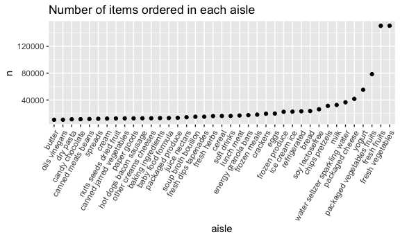

p8105_hw3_lz2949
================
Longyi Zhao
2023-10-09

``` r
library(tidyverse)
```

    ## ── Attaching core tidyverse packages ──────────────────────── tidyverse 2.0.0 ──
    ## ✔ dplyr     1.1.3     ✔ readr     2.1.4
    ## ✔ forcats   1.0.0     ✔ stringr   1.5.0
    ## ✔ ggplot2   3.4.3     ✔ tibble    3.2.1
    ## ✔ lubridate 1.9.2     ✔ tidyr     1.3.0
    ## ✔ purrr     1.0.2     
    ## ── Conflicts ────────────────────────────────────────── tidyverse_conflicts() ──
    ## ✖ dplyr::filter() masks stats::filter()
    ## ✖ dplyr::lag()    masks stats::lag()
    ## ℹ Use the conflicted package (<http://conflicted.r-lib.org/>) to force all conflicts to become errors

``` r
library(dplyr)
library(ggplot2)
library(knitr)

knitr::opts_chunk$set(
  fig.width = 6,
  fig.asp = .6,
  out.width = "90%"
)
```

## Problem 1

``` r
library(p8105.datasets)
data("instacart")
```

``` r
num_aisles = unique(instacart$aisle_id) # number of distinct aisles numbers
frequent_aisles = 
  instacart %>% 
  group_by(aisle) %>%
  summarize(total_item = sum(order_number)) |>
  arrange(desc(total_item)) # most items ordered from 
```

make a plot that shows the number of items ordered in each aisle, (only
aisles ordered more than 10000 items)

``` r
item_aisles = instacart %>%
  group_by (aisle_id) %>%
  summarize(total_item = sum(order_number)) |>
  filter(total_item >= 10000) |>
  ggplot(aes(x = aisle_id, y = total_item)) +
  geom_bar(stat = "identity") +
  labs(title = "Number of Items sold in each Aisle (>=10000)")
 
print(item_aisles) 
```



Make a table showing the three most popular items in “baking
ingredients”, “dog food care”, and “packaged vegetable fruits”

``` r
three_aisle = instacart %>%
  filter(aisle %in% c("baking ingredients", "dog food care", "packaged vegetables fruits"))

# filter product name and add the order_number together
pop_baking = three_aisle  %>%
  filter(aisle == "baking ingredients") %>%
  group_by (product_name) %>%
  summarize(total_item = sum(order_number))
most_baking = pop_baking %>%
  arrange(desc(total_item)) %>%
  slice (1) %>%
  mutate(aisle = "baking ingredients")

# perform similar action to other two aisle
pop_dog = three_aisle  %>%
  filter(aisle == "dog food care") %>%
  group_by (product_name) %>%
  summarize(total_item = sum(order_number))
most_dog= pop_dog %>%
  arrange(desc(total_item)) %>%
  slice (1) %>%
  mutate(aisle = "dog food care")

pop_veg = three_aisle  %>%
  filter(aisle == "packaged vegetables fruits") %>%
  group_by (product_name) %>%
  summarize(total_item = sum(order_number))
most_veg= pop_veg %>%
  arrange(desc(total_item)) %>%
  slice (1) %>%
  mutate(aisle = "packaged vegetables fruits")


# arragne most_baking/dog/veg to a table 
combined_most = bind_rows(most_baking, most_dog, most_veg)
kable(combined_most, 
      caption = "Most popular items in three aisles") 
```

| product_name                 | total_item | aisle                      |
|:-----------------------------|-----------:|:---------------------------|
| Light Brown Sugar            |       8605 | baking ingredients         |
| Standard Size Pet Waste bags |        675 | dog food care              |
| Organic Baby Spinach         |     171301 | packaged vegetables fruits |

Most popular items in three aisles

Make a table showing the mean hour of the day at which Pink lady apples
and coffee ice cream are orderd on each day of the week.

``` r
app_cream = 
  instacart |>
  filter(product_name == "Pink Lady Apples" | product_name == "Coffee Ice Cream") |>
  group_by(order_dow, product_name) |>
  summarize(mean_time = mean(order_hour_of_day)) |>
  pivot_wider(names_from = product_name,
              values_from = mean_time) 
```

    ## `summarise()` has grouped output by 'order_dow'. You can override using the
    ## `.groups` argument.

``` r
# app_cream = app_cream[, -1]
kable(app_cream, 
      caption = "Mean hour of the day ordered for Pink Lady Apples and Coffee Ice Cream")
```

| order_dow | Coffee Ice Cream | Pink Lady Apples |
|----------:|-----------------:|-----------------:|
|         0 |         13.77419 |         13.44118 |
|         1 |         14.31579 |         11.36000 |
|         2 |         15.38095 |         11.70213 |
|         3 |         15.31818 |         14.25000 |
|         4 |         15.21739 |         11.55172 |
|         5 |         12.26316 |         12.78431 |
|         6 |         13.83333 |         11.93750 |

Mean hour of the day ordered for Pink Lady Apples and Coffee Ice Cream

## Problem 2

``` r
library(p8105.datasets)
data("brfss_smart2010")
```

Data cleaning

``` r
brfss_df = 
  brfss_smart2010 |>
  janitor::clean_names() |>
  filter(topic == "Overall Health") |>
  filter(response == "Excellent" | response =="Very good" |response =="Good" |response =="Fair" |response =="Poor") 

order_c = c("Poor", "Fair", "Good", "Very good", "Excellent")
ordered_brfss = brfss_df[order(factor(brfss_df$response, levels = order_c)),]
```

In 2002/2010, which states were observed at 7 or more locations?

``` r
# year 2002
states_two = ordered_brfss |>
  filter(year == "2002") |>
  group_by(locationabbr) |>
  summarize(unique_locations = n_distinct(locationdesc)) 
states_two = states_two |>
  filter(unique_locations >= 7)

# year 2010
states_ten = ordered_brfss |>
  filter(year == "2010") |>
  group_by(locationabbr) |>
  summarize(unique_locations = n_distinct(locationdesc)) 
states_ten = states_ten |>
  filter(unique_locations >= 7)
```

Construct a dataset that is limited to Excellent responses and contains,
year, state, and a variable averages the data_value accross locations
within a state. Make a spaghetti plot.
